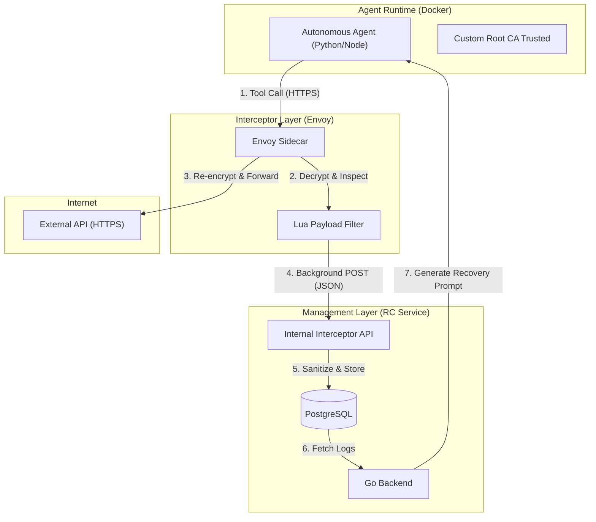

# Envoy HTTPS Interception & Agentic Compensation
**Date: March 4, 2024**
**Status: Verified / Operational**

## 1. Executive Summary

This project implements a **Zero-Code Instrumentation** layer for autonomous AI agents. The primary goal is to capture, log, and potentially roll back (compensate) for tool usage (API calls) made by agents, even when those calls are encrypted (HTTPS) and made to external domains.

Instead of requiring agent developers to use a specific SDK, we use a **Transparent Proxy Service Mesh** pattern. This allows the system to remain "invisible" to the agent while maintaining a perfect audit trail in our database.

## 2. Component Architecture

The following diagram illustrates the flow of a single "Tool Call" from an agent to an external API (like Stripe or a Flight Booking system).

---

## 3. Core Implementation Details

### A. Transparent TLS Interception (The MITM)
To intercept HTTPS traffic without secret keys from the destination (e.g., Google or Stripe), we implement a **Man-In-The-Middle (MITM)** pattern using a custom Root Certificate Authority.

1.  **Certificate Generation**: We generate a self-signed Root CA and a wildcard certificate for Envoy.
    - **File**: `envoy/generate_certs.sh`
2.  **CA Injection**: When the Go Backend spawns an agent container, it injects this Root CA into the container's trusted store.
    - **Environment Variables**:
        - `SSL_CERT_FILE`: Directs OpenSSL/Python to trust our CA.
        - `REQUESTS_CA_BUNDLE`: Directs Python `requests` library.
        - `NODE_EXTRA_CA_CERTS`: Directs Node.js runtimes.
    - **File**: `backend/services/docker.go`
3.  **Proxy Routing**: Every agent is automatically configured with `HTTP_PROXY` and `HTTPS_PROXY` pointing to the Envoy sidecar.

### B. Payload Extraction (Envoy Lua Filter)
The actual logic for "observing" the data happens inside Envoy's memory. We use an embedded Lua script to handle the stream.

- **File**: `envoy/envoy.yaml`
- **Implementation**:
    - The filter waits for the full request and response bodies (using the `buffer` filter).
    - It extracts the `method`, `url`, `host`, `request_body`, and `response_body`.
    - It uses a custom `json_escape` function to sanitize binary or complex characters.
    - It performs a non-blocking `httpCall` to our Backend's internal endpoint.

### C. The Interceptor Bridge (Go Backend)
Since the Lua script has limited logic, we built a robust "Bridge" in Go to handle database persistence and schema management.

- **File**: `backend/api/interceptor_server.go`
- **Key Features**:
    - **Idempotent Agent Creation**: It uses `EnsureEnvoyAgent` to create a sentinel record in the `agents` table if the intercepted traffic comes from a network-level event that the DB hasn't seen yet.
    - **UUID Generation**: Generates 32-character hex IDs for every transaction log to ensure they fit in the `VARCHAR(36)` columns.
    - **JSON Sanitization**: Unmarshals the complex Lua payload and flattens it for the `transaction_logs` table.

---

## 4. Source File Registry

| File Path | Responsibility |
|-----------|----------------|
| `envoy/envoy.yaml` | Core Envoy configuration. Defines listeners, clusters (backend, internet), and the Lua payload filter. |
| `envoy/generate_certs.sh` | Bash script using OpenSSL to create the Root CA and TLS certs used for MITM. |
| `backend/services/docker.go` | Orchestrates agent containers. Responsible for injecting proxy environment variables and CA certificates. |
| `backend/api/interceptor_server.go` | Handles the `POST /internal/envoy/transactions` logic. Transforms raw network data into DB logs. |
| `backend/api/router.go` | Registers the internal routes used by Envoy sidecars. |
| `backend/store/postgres.go` | Contains the SQL logic (`EnsureEnvoyAgent`) to satisfy Foreign Key constraints during logging. |
| `db/migrations/002_create_compensation_mappings.sql` | The database schema for `transaction_logs` and `compensation_mappings`. |

---

## 5. Life of a Intercepted Request

1.  **Agent Action**: The Python agent calls `httpx.post("https://api.stripe.com/v1/charges", ...)`.
2.  **Proxy Redirect**: The OS routes this request to `envoy:10000` because of the `HTTPS_PROXY` env var.
3.  **TLS Termination**: Envoy presents a certificate signed by our `amp-proxy-ca`. The Agent trusts it because of `SSL_CERT_FILE`.
4.  **Inspection**: The `envoy.filters.http.lua` script runs. It reads the Stripe request body into memory.
5.  **Re-encryption**: Envoy initiates a fresh TLS connection to the real `api.stripe.com` and forwards the data.
6.  **Bridge Logging**: Simultaneously, the Lua script sends a JSON blob of the Stripe request/response to the Go Backend.
7.  **Database Storage**: The Go Backend saves this to the `transaction_logs` table, linked to the `agent_id`.

## 6. Forward Looking: Agentic Compensation

With this implementation complete, the "Agentic Compensation" flow becomes possible:
- If a session fails, the Backend queries all `transaction_logs` for that session.
- It builds a **Recovery Prompt** (e.g., "You previously charged a credit card for $50 and booked a flight UA123. Please undo these actions.").
- A new agent is spawned with this prompt and uses its existing tools (`refund_charge`, `cancel_flight`) to perform the rollback autonomously.
