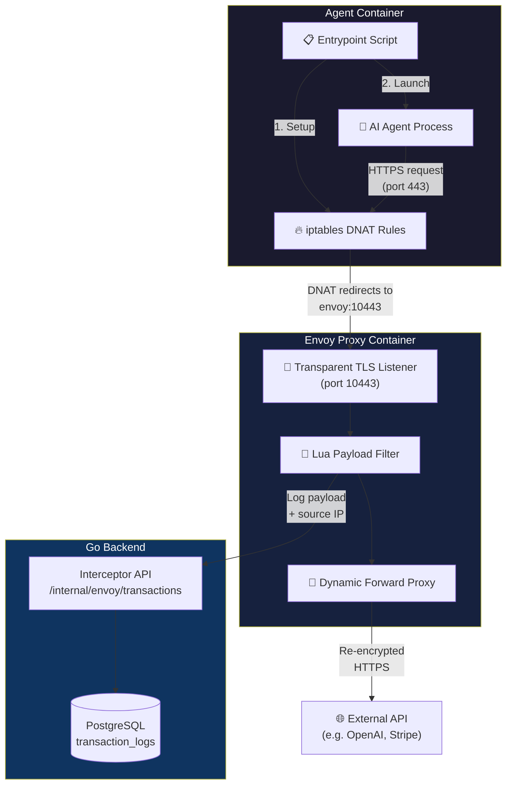
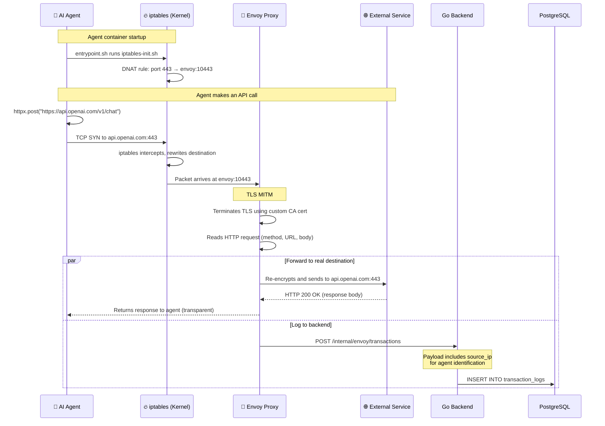
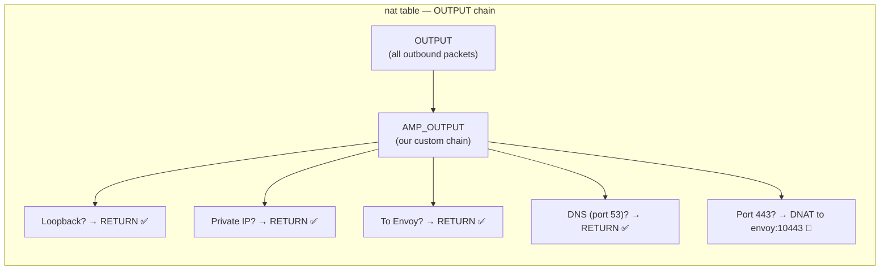
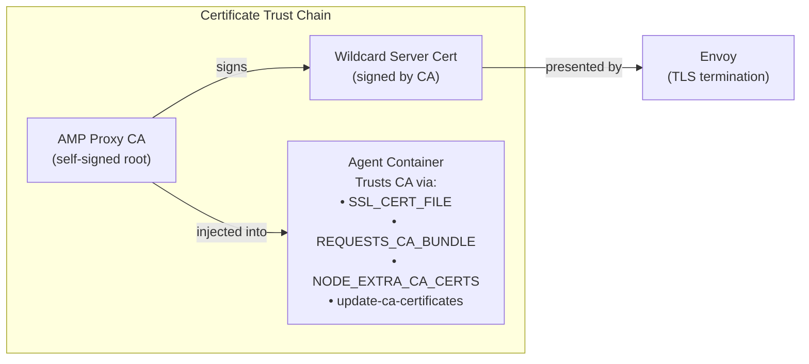
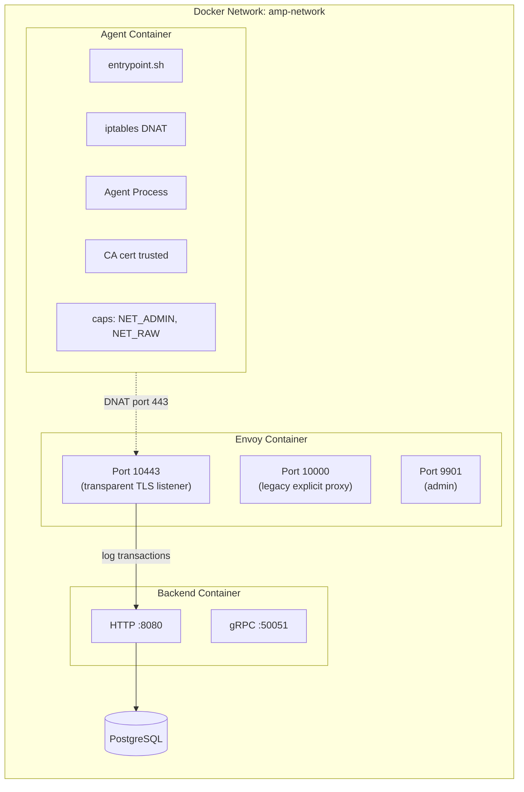
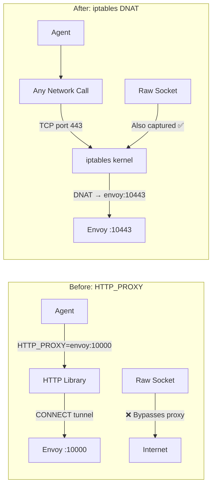

# iptables Transparent Proxy for Agent Traffic Interception
**Date: March 9, 2026**
**Status: Implemented — Pending Runtime Verification**

---

## 1. What This Does (For Everyone)

We intercept **every HTTPS call** an AI agent makes — even if the agent doesn't know it's being watched.

Previously, we relied on the agent's HTTP library to voluntarily route traffic through our proxy (via `HTTP_PROXY` environment variables). This had a fundamental flaw: **agents using low-level networking, custom libraries, or hardcoded connections could bypass interception entirely.**

Now, we use **iptables** — a Linux kernel firewall — to capture traffic at the operating system level. No agent code can bypass it. This is the same technique used by Istio (Google's production service mesh) to enforce network policies on millions of containers.

### Why This Matters

| Concern | Before (HTTP_PROXY) | After (iptables) |
|---------|---------------------|-------------------|
| **Coverage** | Only HTTP libraries that respect proxy env vars | All TCP traffic on port 443 — no exceptions |
| **Agent Awareness** | Agent must cooperate | Fully transparent, zero-code |
| **Bypassable?** | Yes — raw sockets, custom clients | No — kernel-level enforcement |
| **Research Value** | Limited — can't trust completeness | High — guaranteed complete audit trail |
| **Security Posture** | Cooperative | Mandatory |

---

## 2. Architecture Overview



---

## 3. How It Works — Step by Step

### The Life of an Intercepted Request



### Step-by-Step Breakdown

| Step | What Happens | Where |
|------|-------------|-------|
| **1. Container Start** | `entrypoint.sh` runs `iptables-init.sh` before the agent process | Agent Container |
| **2. iptables Setup** | DNAT rule created: all outbound TCP port 443 → `envoy:10443` | Agent Container (kernel) |
| **3. Agent Request** | Agent calls `https://api.openai.com/...` normally | Agent Container |
| **4. Kernel Intercept** | OS redirects the packet to Envoy instead of the internet | Agent Container (kernel) |
| **5. TLS Termination** | Envoy decrypts HTTPS using our custom CA certificate | Envoy Container |
| **6. Payload Capture** | Lua filter reads the request method, URL, headers, body | Envoy Container |
| **7. Re-encryption** | Envoy opens a fresh TLS connection to the real API | Envoy Container |
| **8. Logging** | Lua sends the captured payload to Go backend | Envoy → Backend |
| **9. Storage** | Backend stores in `transaction_logs` with source IP | Backend → PostgreSQL |
| **10. Response** | Agent receives the real API response, unaware of interception | Agent Container |

---

## 4. iptables Deep Dive (For Developers)

### What is iptables?

`iptables` is the Linux kernel's built-in packet filtering framework. It operates at **Layer 3/4** (IP/TCP), meaning it intercepts every network packet before it leaves the container — regardless of which application or library generated it.

### Our iptables Rules

We create a custom chain called `AMP_OUTPUT` in the `nat` table:



**The actual rules:**

```bash
# Create custom chain
iptables -t nat -N AMP_OUTPUT
iptables -t nat -A OUTPUT -p tcp -j AMP_OUTPUT

# Exclusions (traffic that bypasses the proxy)
iptables -t nat -A AMP_OUTPUT -o lo -j RETURN              # Loopback
iptables -t nat -A AMP_OUTPUT -d 10.0.0.0/8 -j RETURN      # Docker internal
iptables -t nat -A AMP_OUTPUT -d 172.16.0.0/12 -j RETURN    # Docker internal
iptables -t nat -A AMP_OUTPUT -d 192.168.0.0/16 -j RETURN   # Docker internal
iptables -t nat -A AMP_OUTPUT -d $ENVOY_IP -j RETURN        # Don't redirect Envoy traffic
iptables -t nat -A AMP_OUTPUT -p tcp --dport 53 -j RETURN   # DNS

# The redirect — this is the key rule
iptables -t nat -A AMP_OUTPUT -p tcp --dport 443 -j DNAT --to-destination $ENVOY_IP:10443
```

### Why DNAT (Not REDIRECT)

| Approach | How it works | Our use case |
|----------|-------------|--------------|
| `REDIRECT` | Changes destination to `localhost:<port>` | ❌ Envoy runs in a separate container |
| `DNAT` | Changes destination to any `IP:port` | ✅ Redirects to Envoy on Docker network |
| `TPROXY` | Transparent proxy, preserves source IP | ❌ Complex, Docker bridge issues |

We use `DNAT` because Envoy runs as a standalone container on the same Docker network. The agent container resolves `envoy` via Docker DNS and uses its IP as the DNAT target.

### Agent Identification via Source IP

Since each agent container has a unique IP on the Docker bridge network, Envoy's Lua filter captures the **source IP** of each intercepted connection. The Go backend can map this IP back to an agent ID using the Docker API.

```text
Agent container 172.18.0.5 → Envoy sees source 172.18.0.5 → Backend maps to agent "agent-abc123"
```

---

## 5. TLS Interception (The MITM)

For HTTPS interception to work, the agent must trust our custom Certificate Authority. Here's how:



The wildcard certificate covers major AI/API providers:
- `*.openai.com`, `*.anthropic.com`, `*.googleapis.com`
- `*.stripe.com`, `*.github.com`, `*.amazonaws.com`
- `*.azure.com`, `*.huggingface.co`
- Plus generic wildcards (`*`, `*.*`, `*.*.*`)

---

## 6. Container Architecture



### What Each Container Needs

| Container | Capabilities | Volumes | Extra |
|-----------|-------------|---------|-------|
| Agent | `NET_ADMIN`, `NET_RAW` | — | CA cert baked into image |
| Envoy | Default | `envoy.yaml`, `certs/` | Listens on 10000 + 10443 |
| Backend | Default | Docker socket | Manages agent containers |

---

## 7. Source File Registry

| File | Purpose |
|------|---------|
| `envoy/iptables-init.sh` | iptables DNAT rules — the core of transparent interception |
| `backend/services/templates/entrypoint.sh` | Runs iptables-init.sh then launches the agent |
| `envoy/envoy.yaml` | Envoy config with transparent TLS listener on port 10443 |
| `envoy/generate_certs.sh` | Generates CA + wildcard cert with broad SAN coverage |
| `backend/services/docker.go` | Container orchestration — injects caps, CA, scripts |
| `backend/services/templates/Dockerfile.python` | Python agent image — includes iptables + CA + entrypoint |
| `backend/services/templates/Dockerfile.node` | Node.js agent image — includes iptables + CA + entrypoint |
| `backend/api/interceptor_server.go` | Receives and stores intercepted transactions |
| `docker-compose.yml` | Service orchestration — exposes port 10443 |

---

## 8. Comparison: Before vs After



---

## 9. Known Limitations & Future Work

| Limitation | Impact | Future Fix |
|-----------|--------|------------|
| Only port 443 intercepted | HTTP (port 80) and non-standard ports bypass | Add rules for port 80, custom ports |
| Agent ID via source IP mapping | Requires Docker API lookup | Inject `x-amp-agent-id` header via middleware |
| Single Envoy instance | All agents share one proxy | Per-agent Envoy sidecars (Istio model) |
| Certs need regeneration for new domains | New SANs require cert rebuild | Dynamic cert generation (SDS) |
| `NET_ADMIN` capability on agents | Expanded container permissions | Move iptables to init container or CNI plugin |

---

## 10. Agentic Compensation (Unchanged)

The iptables change is **additive** — the compensation flow described in the [original Envoy implementation doc](envoy-implementation-march-4.md) works exactly the same way:

1. All intercepted transactions are stored in `transaction_logs`
2. The recovery service builds a LIFO rollback plan
3. A new agent can be spawned with a recovery prompt to undo actions

The only difference is that we now have **higher confidence in the completeness** of the transaction log, because iptables captures traffic that `HTTP_PROXY` would have missed.
